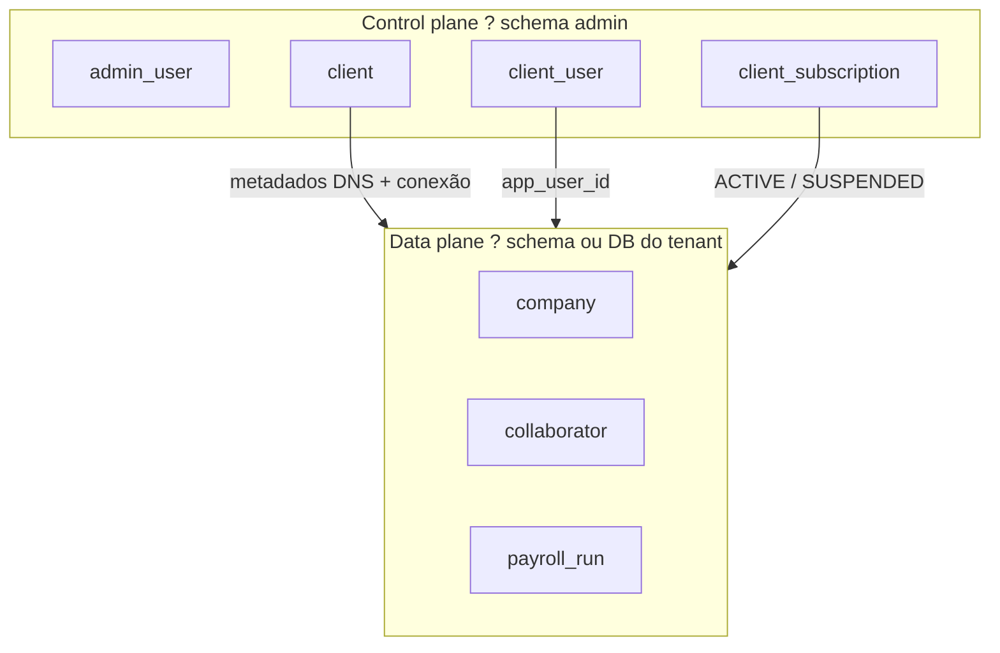
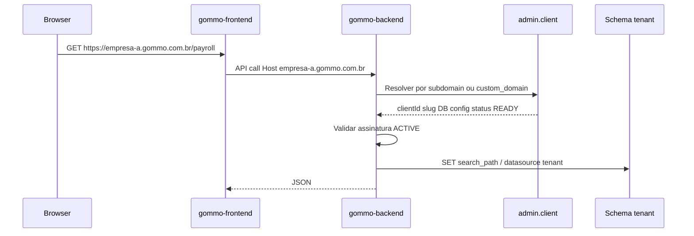

# Arquitetura multi-tenant ? Gommo

Documentação oficial do modelo **control plane + data plane** do Gommo ERP.

**Status:** em implementação (resolver, JWT, schema por tenant e frontend multi-host).

**Relacionado:**

- Painel admin: [gommo-admin-frontend/docs/TUTORIAL-PAINEL-ADMIN.md](../../gommo-admin-frontend/docs/TUTORIAL-PAINEL-ADMIN.md)
- Desenvolvimento local: [multi-tenant-dev.md](./multi-tenant-dev.md)
- Plano de implementação: [multi-tenant-implementacao.md](./multi-tenant-implementacao.md)

---

## 1. Visão de negócio

A **Gommo** vende licenças de ERP de RH. Cada **cliente comprador** (tenant) opera o sistema de forma isolada:

| Ator | Sistema | URL (exemplo) |
|------|---------|---------------|
| Equipe Gommo (vendas, suporte) | Admin | `https://admin.gommo.com.br` |
| Cliente Empresa A (sócios, RH, DP) | ERP HR | `https://empresa-a.gommo.com.br` |
| Cliente Empresa B | ERP HR | `https://empresa-b.gommo.com.br` |

O usuário do cliente **não escolhe empresa** ao usar folha, admissão ou departamentos. Ele já está no contexto da licença que comprou. A empresa do cadastro comercial (`admin.client`) coincide com o empregador legal (`company` no schema do tenant), criada no provisionamento.

---

## 2. Dois planos



| Plano | Schema / app | Conteúdo |
|-------|--------------|----------|
| **Control plane** | `admin.*`, `gommo-admin-*` | Quem é o cliente, subdomínio, assinatura, operadores Gommo |
| **Data plane** | `tenant_*` ou DB dedicado, `gommo-backend` + `gommo-frontend` | Colaboradores, folha, ponto, férias |

O HR **nunca** consulta dados de RH de outro tenant no mesmo request. O admin **nunca** mistura metadados de clientes no data plane ? só registra como conectar.

---

## 3. Conceitos

| Termo | Onde | Significado |
|-------|------|-------------|
| **Tenant** | `admin.client` | Cliente que comprou a licença (Empresa A) |
| **Slug** | `admin.client.slug` | Identificador curto (`empresa-a`) |
| **Subdomínio** | `admin.client.subdomain` | Parte DNS (`empresa-a` ? `empresa-a.gommo.com.br`) |
| **Empresa (RH)** | `company` no schema do tenant | CNPJ empregador ? holerite, eSocial, contratos |
| **Operador plataforma** | `admin.admin_user` | Funcionário Gommo com `platform:admin` |
| **Usuário do tenant** | `admin.client_user` ? `public.app_user` | Sócio / admin inicial do cliente |

**Regra:** 1 tenant (licença) = 1 empresa empregadora no MVP. Vários CNPJs no mesmo tenant é cenário futuro (holding).

---

## 4. Resolução de tenant (produção)

Fluxo em cada request ao ERP:



### 4.1 Modos de roteamento (`routing_mode`)

| Modo | Campo | Exemplo |
|------|-------|---------|
| `SUBDOMAIN` | `subdomain` | `empresa-a.gommo.com.br` |
| `CUSTOM_DOMAIN` | `custom_domain` | `rh.empresa-a.com.br` |

### 4.2 Algoritmo de resolução (contrato)

1. Ler header `Host` (sem porta) ou `X-Tenant-Slug` (API separada / dev).
2. Se host = domínio admin ? **não** aplicar tenant (rotas admin usam outro backend).
3. Se host termina com `.gommo.com.br` ? extrair subdomínio ? `WHERE subdomain = ?`.
4. Se não ? `WHERE custom_domain = ?`.
5. Validar `provisioning_status = READY` e assinatura `ACTIVE` (ou equivalente).
6. Publicar `TenantContext` (clientId, slug, schema) no thread/request.
7. `SET search_path TO "tenant_*", public` (tabelas de negócio no tenant; enums/auth em `public`).
8. Limpar contexto ao fim do request.

---

## 5. Isolamento de dados (decisão MVP)

**Escolha:** `DEDICATED_SCHEMA` ? um schema PostgreSQL por tenant no mesmo cluster.

| Estratégia | MVP | Enterprise futuro |
|------------|-----|-------------------|
| `DEDICATED_SCHEMA` | **Sim** | ? |
| `DEDICATED_DATABASE` | Opcional manual | Clientes grandes / contrato |
| Coluna `tenant_id` em todas as tabelas | **Não** | Risco alto em DP |

Exemplo local:

```
postgres / database gommo
??? admin                 (control plane)
??? public                (auth compartilhado + dev legado)
??? tenant_empresa_a      (RH Empresa A)
??? tenant_empresa_b      (RH Empresa B)
```

---

## 6. Autenticação e escopo

### 6.1 Admin (`gommo-admin-backend`)

- JWT com `principalType=PLATFORM_ADMIN`.
- Acesso a `/api/v1/clients`, provisionamento, assinaturas.
- URL fixa: `admin.gommo.com.br`.

### 6.2 ERP (`gommo-backend`)

- JWT com `tenantId` (UUID do `admin.client`) após login.
- Login valida:
  1. Tenant resolvido pelo `Host` ou header `X-Tenant-Slug`.
  2. Credenciais em `public.app_user` (auth compartilhado).
  3. `admin.client_user` liga `app_user_id` ao `client_id` do tenant resolvido.
- Request autenticado rejeitado se `JWT.tenantId` ? `TenantContext.clientId`.
- **Host sem subdomínio** (`localhost` em dev): modo *platform* ? só usuários em `admin.admin_user`, schema `public`.
- **Host com subdomínio** (`empresa-a.gommo.com.br`): modo *tenant* ? dados de negócio no schema do cliente.

### 6.3 Frontend HR (`gommo-frontend`) ? multi-host

Cada tenant acessa o **mesmo deploy** Next.js por URL diferente. Implicações:

| Tópico | Decisão |
|--------|---------|
| Sessão | Cookie por host ? sessões **não** compartilhadas entre tenants |
| `AUTH_URL` no `.env` | Um valor canônico ? **não** cobre todos os subdomínios |
| Logout | `signOutToTenantLogin()` ? navegação única para `/api/auth/signout?callbackUrl=<login no host atual>` |
| Login tenant | Bloqueado em host sem subdomínio quando `NEXT_PUBLIC_MULTI_TENANT_ENABLED=true` |
| API | Header `X-Tenant-Slug` derivado do hostname ou da sessão |

Padrão válido em **dev e produção** enquanto houver múltiplos hosts e `AUTH_URL` fixo no Auth.js.

**Produção (recomendado):** same-origin ? `https://empresa-a.gommo.com.br` serve UI e faz proxy de `/api` para o backend.

Detalhes de dev local: [multi-tenant-dev.md](./multi-tenant-dev.md).

### 6.4 Claims JWT (HR)

```json
{
  "sub": "<app_user_uuid>",
  "type": "access",
  "tenantId": "<client_uuid>",
  "tenantSlug": "empresa-a",
  "permissions": ["payroll:read", "..."]
}
```

---

## 7. Onboarding de novo cliente

Fluxo operado pela equipe Gommo no admin:

1. **Clientes ? Novo** ? nome, slug, CNPJ, contato, subdomínio, schema (`tenant_empresa_a`).
2. **Testar conexão** ? **Executar provisionamento** (schema + tabelas; Flyway por tenant em evolução).
3. **Assinatura** ? plano `PRO`, status `ACTIVE`.
4. **Usuários administrativos** ? login inicial do sócio.
5. Cliente acessa `https://empresa-a.gommo.com.br` e completa cadastros.

### Seed no provisionamento (MVP)

| Artefato | Origem |
|----------|--------|
| `company` no schema tenant | Dados de `admin.client` (nome, CNPJ, contato) |
| Roles / permissões | Padrão do plano |
| Primeiro admin | Já criado em `client_user` |

---

## 8. DNS e infraestrutura (produção)

| Registro DNS | Destino |
|--------------|---------|
| `admin.gommo.com.br` | `gommo-admin-frontend` |
| `admin-api.gommo.com.br` | `gommo-admin-backend` |
| `*.gommo.com.br` | `gommo-frontend` (wildcard) |
| API no **mesmo host** do app (recomendado) | `gommo-backend` via reverse proxy `/api` |
| `api.gommo.com.br` (alternativa) | `gommo-backend` + CORS por origem |

Traefik/Coolify encaminha todos os subdomínios para o mesmo serviço Next.js; **a aplicação** resolve o tenant pelo `Host`.

### Dev vs produção (resumo)

| | Dev | Produção |
|---|-----|----------|
| Subdomínio tenant | `{slug}.localhost` | `{slug}.gommo.com.br` |
| `GOMMO_TENANT_BASE_DOMAIN` | `localhost` | `gommo.com.br` |
| API separada na porta | `:8081` / `:3000` | Preferir same-origin |
| Schema `public` | Dev legado + auth | Auth/enums; dados novos no `tenant_*` |

Domínio customizado: cliente configura CNAME `rh.cliente.com.br` ? `empresa-a.gommo.com.br`; registrar em `admin.client.custom_domain`.

Detalhes de deploy: [infra/coolify/README.md](../../infra/coolify/README.md).

---

## 9. Impacto no ERP (UX)

| Antes (single-tenant) | Depois (multi-tenant) |
|-----------------------|------------------------|
| Picker "Empresa" na competência | Removido ? `companyId` automático |
| `localhost:3000` único | `{slug}.localhost:3000` (tenant) ou `localhost` (platform) |
| Um schema `public` | Schema por tenant |
| Sem validação de assinatura | Bloqueio se `SUSPENDED` / não provisionado |

---

## 10. O que já existe vs. o que falta

| Peça | Status |
|------|--------|
| `admin.client` + DNS + DB metadata | Implementado |
| CRUD assinatura / pagamento / client_user | Implementado |
| Tenant resolver + `search_path` no `gommo-backend` | Implementado |
| JWT com `tenantId` + validação `client_user` | Implementado |
| Provisionamento schema + clone tabelas (admin) | Implementado |
| Frontend: header tenant + logout multi-host | Implementado |
| Job provisionamento (Flyway por tenant + seed company) | Pendente |
| Wildcard DNS produção + same-origin API | Pendente (infra) |
| Remover picker empresa / auto `companyId` | Pendente |

---

## 11. Glossário

| Termo | Definição |
|-------|-----------|
| Control plane | Admin + schema `admin` |
| Data plane | Banco/schema onde vive o RH do tenant |
| Provisionamento | Criar/validar ambiente isolado do tenant |
| Resolver | Mapear `Host` HTTP ? registro `admin.client` |
