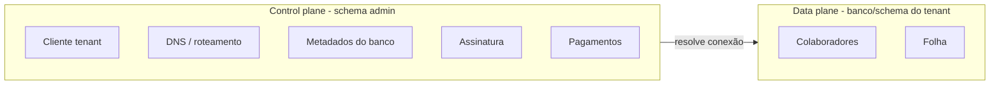

# Tutorial — Painel administrativo Gommo

Este guia explica, em linguagem simples, o que é o **painel admin** (`gommo-admin-frontend` + `gommo-admin-backend`) e como usar cada parte do menu **Gestão de clientes**.

---

## 1. Por que existem dois sistemas?

O Gommo é dividido em dois produtos que conversam entre si:

| Sistema                | Onde roda         | Para quem                                | O que guarda                                                               |
| ---------------------- | ----------------- | ---------------------------------------- | -------------------------------------------------------------------------- |
| **RH (HR)**            | `:3000` / `:8081` | Colaboradores e gestores de cada empresa | Folha, férias, colaboradores, etc.                                         |
| **Admin (plataforma)** | `:3001` / `:8082` | Equipe interna da Gommo                  | Cadastro de **clientes (tenants)**, contratos, cobrança, usuários iniciais |

O admin **não substitui** o RH. Ele **orquestra** quem pode usar o RH e **onde** os dados de cada cliente ficam guardados.

---

## 2. Control plane vs data plane (conceito-chave)

Pense em dois planos:



- **Control plane** (`admin` no PostgreSQL): metadados da plataforma — quem é o cliente, qual subdomínio, qual host de banco, status de provisionamento, plano, faturas.
- **Data plane** (banco ou schema dedicado por cliente): dados reais de RH — colaboradores, folha, etc.

O painel admin **nunca mistura** dados de RH de clientes diferentes no mesmo banco de trabalho; ele só registra **como chegar** no banco certo quando o usuário acessa `acme.gommo.com` (exemplo).

---

## 3. Quem acessa o admin?

- **Operadores da plataforma** (`/admin-users`): funcionários da Gommo com permissão `platform:admin`.
- **Usuários administrativos do cliente** (`/client-users`): login inicial do tenant no RH (criados no admin, gravados também no schema `public` do HR).

Login do admin: `http://localhost:3001` (dev). Credenciais padrão vêm do `.env` (`DEV_ADMIN_USERNAME` / `DEV_ADMIN_PASSWORD`).

---

## 4. Menu — Gestão de clientes

### 4.1 Clientes

Cadastro do **tenant**: empresa que contratou o Gommo.

**Seções do formulário:**

1. **Cliente** — nome, slug (identificador único na URL), CNPJ, contato.
2. **Roteamento DNS** — como o sistema descobre qual tenant é:
    - `SUBDOMAIN`: ex. slug `acme` → `acme.gommo.com`
    - `CUSTOM_DOMAIN`: ex. `rh.acme.com`
3. **Conexão de dados** — onde ficam os dados de RH desse cliente:
    - `DEDICATED_DATABASE`: um banco PostgreSQL só para o cliente
    - `DEDICATED_SCHEMA`: um schema dentro de um banco compartilhado
    - Host, porta, nome do banco, schema, usuário, **referência de segredo** (senha não fica no formulário em texto claro)
4. **Provisionamento** — estado operacional do tenant:
    - `PENDING` → ainda não validado
    - `PROVISIONING` → validação em andamento
    - `READY` → conexão OK
    - `ERROR` → falha (ver notas)
    - `SUSPENDED` → bloqueado

**Ações (ao editar um cliente):**

- **Testar conexão do banco** — tenta conectar com os metadados informados (útil antes de liberar o cliente).
- **Executar provisionamento** — marca como provisionando, testa a conexão e atualiza para `READY` ou `ERROR`.

**Senha em desenvolvimento:** se `databaseSecretRef` apontar para uma variável de ambiente (ex. `DB_PASSWORD`) ou você definir `TENANT_DB_FALLBACK_PASSWORD` / `gommo-admin.tenant-db.fallback-password`, o teste usa essa senha. Em produção, use vault (`databaseSecretRef`).

### 4.2 Usuários administrativos do cliente

Cria o **primeiro acesso** (ou outros admins) de um tenant no RH: usuário, e-mail, senha, vínculo ao cliente.

Fluxo típico:

1. Cadastrar o **Cliente** e provisionar (`READY`).
2. Cadastrar **Usuário administrativo** escolhendo esse cliente.
3. O usuário faz login no RH (`:3000`) com essas credenciais.

### 4.3 Status e assinatura

CRUD de **contrato comercial** por cliente:

- Plano (`STARTER`, `PRO`, `ENTERPRISE` ou outro código)
- Status de cobrança: `ACTIVE`, `SUSPENDED`, `CANCELLED`
- Valor mensal, datas de início/fim, observações

Isso é controle **comercial** da plataforma, não o status técnico `READY` do provisionamento (embora ambos influenciem decisões de negócio).

### 4.4 Pagamentos

Registro manual de **cobranças** por cliente:

- Referência, valor, vencimento
- Status: `PENDING`, `PAID`, `OVERDUE`, `CANCELLED`
- Data de pagamento (quando pago)

Útil para histórico e inadimplência até integrar gateway de pagamento.

### 4.5 Permissões do cliente

Ainda em evolução (placeholder). Futuro: quais módulos do RH o plano libera.

---

## 5. Fluxo recomendado — novo cliente

1. **Clientes → Novo** — preencher dados comerciais + DNS + conexão DB.
2. **Salvar**, depois **Testar conexão**.
3. Se OK, **Executar provisionamento** (deve ir para `READY`).
4. **Status e assinatura** — registrar plano ativo.
5. **Pagamentos** — registrar primeira fatura, se aplicável.
6. **Usuários administrativos** — criar login do tenant.
7. Cliente acessa o RH no subdomínio/domínio configurado.

---

## 6. Banco de dados e migrations

- Schema **`admin`**: tabelas do admin (`client`, `client_subscription`, `client_payment`, …).
- Flyway do admin: `gommo-admin-backend/src/main/resources/db/migration/` (`V1`, `V2`, `V3`…).
- Após subir o backend admin, confira se `V3__client_subscription_and_payment.sql` foi aplicada.

Comando útil (com Docker):

```bash
docker compose up -d postgres
cd gommo-admin-backend && ./mvnw spring-boot:run
```

Frontend admin:

```bash
cd gommo-admin-frontend && npm run dev
```

---

## 7. APIs principais (referência rápida)

| Recurso             | Base path                                                    |
| ------------------- | ------------------------------------------------------------ |
| Clientes            | `POST/GET/PUT/DELETE /api/v1/clients`                        |
| Testar DB           | `POST /api/v1/clients/{id}/actions/test-database-connection` |
| Provisionar         | `POST /api/v1/clients/{id}/actions/start-provisioning`       |
| Assinaturas         | `/api/v1/client-subscriptions`                               |
| Pagamentos          | `/api/v1/client-payments`                                    |
| Usuários do cliente | `/api/v1/client-users`                                       |

Todas exigem JWT de operador com `platform:admin`.

---

## 8. O que ainda vem depois

- Provisionamento automático (criar banco/schema via job, não só validar conexão).
- Integração com gateway de pagamento.
- Tela de **Permissões do cliente** (pacotes de módulos).
- Métricas e alertas por tenant no Grafana.

---

## 9. Glossário

| Termo               | Significado                                        |
| ------------------- | -------------------------------------------------- |
| **Tenant**          | Um cliente da plataforma (uma empresa contratante) |
| **Slug**            | Identificador curto na URL (`acme`)                |
| **Control plane**   | Admin + schema `admin`                             |
| **Data plane**      | Banco/schema onde vivem dados de RH                |
| **Provisionamento** | Processo de validar/preparar o ambiente do tenant  |

---

Dúvidas sobre um campo específico? Abra o formulário de **Clientes** no admin e compare com as seções 4.1–4.4 deste tutorial.
