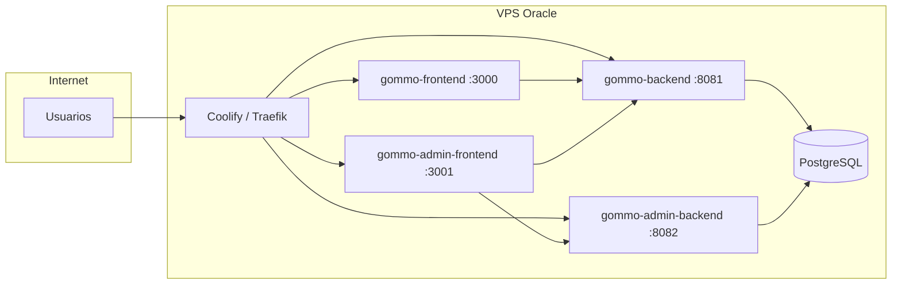

# Deploy Gommo com Coolify

O [Coolify](https://coolify.io) roda na sua VPS (provisionada com [Terraform](../terraform/oci/README.md)) e faz build + proxy HTTPS dos containers.

## Visão geral



## 1. Instalar Coolify na VPS

Se ainda não instalou:

```bash
ssh ubuntu@SEU_IP_PUBLICO
curl -fsSL https://cdn.coollabs.io/coolify/install.sh | sudo bash
```

Acesse `http://SEU_IP:8000`, crie o usuário admin e conecte o servidor (localhost).

## 2. Criar o projeto no Coolify

1. **+ Add Resource** → **Docker Compose**
2. Conecte o repositório Git do Gommo (GitHub/GitLab)
3. Configuração importante:

| Campo | Valor |
|-------|--------|
| **Base Directory** | `/` (raiz do monorepo) |
| **Docker Compose location** | `infra/coolify/docker-compose.yml` |
| **Build pack** | Docker Compose |

4. Em **Environment Variables**, copie as chaves de [`.env.example`](.env.example) e preencha com valores reais (senhas fortes).

## 3. Domínios e HTTPS

Após o primeiro deploy, em cada serviço exposto pelo Coolify, associe um domínio e ative **Let's Encrypt**:

| Serviço | Sugestão de host | Porta interna |
|---------|------------------|---------------|
| `gommo-frontend` | `app.seudominio.com.br` | 3000 |
| `gommo-admin-frontend` | `admin.seudominio.com.br` | 3001 |
| `gommo-backend` | `api.seudominio.com.br` | 8081 |
| `gommo-admin-backend` | `admin-api.seudominio.com.br` | 8082 |

Atualize as variáveis de ambiente para usar **https** nas URLs (`CORS_ORIGINS`, `NEXT_PUBLIC_*`, `NEXTAUTH_URL`, etc.) e faça **Redeploy**.

O Postgres **não** recebe domínio público — apenas a rede interna Docker.

## 4. Variáveis obrigatórias

Gere segredos (PowerShell):

```powershell
[Convert]::ToBase64String((1..32 | ForEach-Object { Get-Random -Maximum 256 }) -as [byte[]])
```

Mínimo para subir:

- `POSTGRES_PASSWORD`, `JWT_SECRET`, `NEXTAUTH_SECRET`
- URLs públicas alinhadas aos domínios do passo 3

Consulte [`.env.example`](.env.example) para a lista completa.

## 5. Primeiro deploy

1. **Deploy** no Coolify e acompanhe os logs de build (Maven + Next podem levar 10–20 min na primeira vez em VPS Free Tier).
2. Flyway roda automaticamente nos backends (`public` e `admin`).
3. Crie o usuário admin inicial conforme o README do `gommo-admin-backend` (seed/migration de dev **não** deve ir para produção sem revisão).

## 6. Recursos na Oracle Free Tier

Stack completa (~4 GB RAM nos limites do compose). Recomendado na VM Ampere:

- **2 OCPU / 12 GB RAM** (padrão do Terraform)
- Se faltar memória, reduza limites em `docker-compose.yml` ou suba só HR primeiro

## Deploy alternativo (serviços separados)

Em vez de um Compose único, você pode criar **4 Applications** + **1 Database** no Coolify:

- Database: PostgreSQL 16
- Apps com **Dockerfile** em `gommo-backend/`, `gommo-admin-backend/`, etc.
- Mesmas variáveis de ambiente, apontando `DB_HOST` para o hostname interno do Postgres no Coolify

O Compose único é mais simples para começar.

## Troubleshooting

| Sintoma | O que verificar |
|---------|-----------------|
| Build Maven falha | Logs do Coolify; memória da VPS |
| CORS no browser | `CORS_ORIGINS` / `ADMIN_CORS_ORIGINS` com URL exata do frontend |
| NextAuth redirect | `HR_NEXTAUTH_URL` / `ADMIN_NEXTAUTH_URL` com https e sem barra final |
| 502 no proxy | Healthcheck do backend; Postgres healthy |
| Flyway error | Postgres vazio vs. volume antigo; conferir schemas `public` e `admin` |
